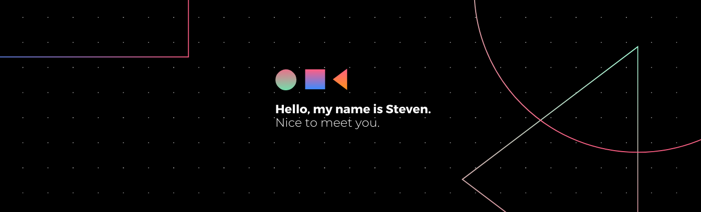

# Steven A. Coaila 👨‍💻

## 👋 Full-Stack Developer | React • TypeScript • Swift • Node.js

Soy **Steven A. Coaila**, desarrollador especializado en crear experiencias digitales excepcionales. Construyo aplicaciones web modernas con React/TypeScript y apps móviles iOS con SwiftUI.

### 💻 Tecnologías

  
  
  
  
  
  
  
  
  

### 🚀 Especialidades

### 📊 Estadísticas de GitHub

  
  

### 🏆 Logros GitHub

  

### 🌟 Proyectos Destacados

Siempre estoy trabajando en proyectos interesantes que combinan tecnología y creatividad. Echa un vistazo a mis repositorios para ver mis últimos desarrollos en React, Swift y Node.js.

### 🤝 Conecta conmigo

  

### 💭 Filosofía de Desarrollo

> "El código limpio no se escribe siguiendo un conjunto de reglas. Se escribe con la disciplina derivada de la experiencia." 

Creo firmemente en escribir código mantenible, crear experiencias de usuario excepcionales y en el aprendizaje continuo. Cada proyecto es una oportunidad para innovar y mejorar.

---

  

⚡ **Disponible para nuevos proyectos y oportunidades** | 📧 **Contacto profesional via LinkedIn**
